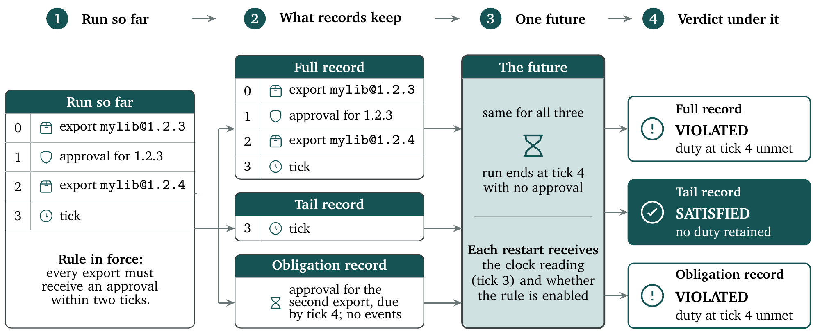

<p align="center">
  <picture>
    <source media="(prefers-color-scheme: dark)" srcset="docs/assets/logo-dark.svg">
    
  </picture>
</p>

# Trace contracts for shortened agent records

<p align="center">
  
  
  
  
  
</p>

> [!NOTE]
> A long-running AI agent's working history can outgrow its model's
> context window, and then part of the record has to be dropped. This
> repository asks one question about such a shortened record: is there a
> possible future on which a checker reads it differently from the full
> history? `interpreter/` is a small reference interpreter that answers it,
> and `abstraction-capsule/` is one worked example in which a shortening
> that keeps only the last event loses an owed approval, while a shortening
> that keeps a table of open duties does not.

With Python 3.11 to 3.13 and [uv](https://docs.astral.sh/uv/) installed
(see [Installing](#installing)), the command below runs the example from
the repository root. It prints a JSON array holding one record per
comparison.

```sh
(
  cd abstraction-capsule
  uv run --frozen python -I -m rs_capsule
)
```

## A worked example

### The run and its rule

An agent publishes two versions of a software package, first `mylib@1.2.3`
and then `mylib@1.2.4`. One rule is in force for the whole run: each
publication has to be approved within two ticks, where a tick is one step
of the run's clock (0, 1, 2, and so on). Four entries make up the record:

| Tick | Event | What it means under the rule |
|---|---|---|
| 0 | `export` | `mylib@1.2.3` goes out; an approval is owed by tick 2 |
| 1 | `approval` | the gate passes for 1.2.3, which settles the first duty |
| 2 | `export` | `mylib@1.2.4` goes out; an approval is owed by tick 4 |
| 3 | `tick` | the clock moves on and nothing else happens |

An approval pays for one publication and no more, so when the record stops
at tick 3 the first release has been approved, the second has not, and its
approval falls due at tick 4. In this repository's vocabulary the history
is a trace, the standing rule a contract, and any possible future of the
run a continuation.

### Two shortenings

Suppose the history now has to be shortened. The example builds two
shortened records by hand. The tail record keeps the last event only, the
clock tick at 3. The obligation record keeps no events at all; it keeps a
one-row table saying that the second export still owes an approval by tick 4.

<p align="center">
  
</p>
<p align="center"><em>Three records of the same run, and one future that tells them apart.</em></p>

### What the interpreter finds

The interpreter runs the full record and each shortened record through
every admitted continuation, up to a declared bound: here, the
seven continuations of length at most two that can be built from an
approval and an end of run. After each continuation it compares two
readings only: whether the contract is satisfied, violated or not yet
decided, and whether the run is still active.

One continuation tells the tail record apart. Let the run end at tick 4
with no further approval: the interpreter appends `Complete`, the event
that marks a finished run, and reads the records again. The full record
reads `Violated/Complete`, since the second duty has reached its deadline
unmet. The tail record carried no duty into the shortening, so the same
ending reads `Satisfied/Complete` there. The readings differ, so the
interpreter returns `Distinguished` and names that continuation as the
witness. The obligation record carried the duty, so it reads the breach
exactly as the full record does, and across all seven continuations the
two never disagree; for it the interpreter returns `NoWitnessWithinBound`.

> [!IMPORTANT]
> The interpreter returns one of two things: a counterexample future, or a
> search completed out to a declared bound. A completed search holds only
> within that bound, and it is a weaker statement than a proof that the two
> records are equivalent.

## What the repository contains

| Directory | Package | What it is |
|---|---|---|
| `interpreter/` | `rs_metalang_ref` | The reference interpreter. It executes the worked bounded-response and residual-comparison fragment of the specification, and exposes a small set of supporting utilities, listed in its README. |
| `abstraction-capsule/` | `rs-capsule-acceptance` | The worked example above. It compares the full record against each shortened record under one fixed comparison profile and prints what it found. |

The normative Meta-Language Specification is distributed separately and is
not included in this repository.

> [!CAUTION]
> The two directories must stay siblings: the capsule's lockfile records the
> interpreter at the relative path `../interpreter` and installs it from
> source, so moving either directory breaks the lockfile.

## Installing

You need Python 3.11 to 3.13 and [uv](https://docs.astral.sh/uv/), the Python
package manager these packages are locked against. On macOS or Linux:

```sh
curl -LsSf https://astral.sh/uv/install.sh | sh
```

Nothing else is needed: each `uv run` command in this README reads the
package's lockfile and builds an isolated environment on first use.

## Running the test suites

Each package carries its own suite, run from its own directory:

```sh
(
  cd interpreter
  uv run --frozen python -m pytest -p no:cacheprovider -q
)
(
  cd abstraction-capsule
  uv run --frozen python -m pytest -p no:cacheprovider -q
)
```

The suites exercise implemented cases; passing them does not by itself
establish full conformance to the specification. The source map in
`interpreter/README.md` associates test modules with their specification
topics, through labels such as `S1.4` that are local traceability markers,
not specification section numbers.

## Licence and provenance

This repository is maintained by Recursive Safeguarding Ltd
([recursive-safeguarding.org](https://recursive-safeguarding.org)).
The code is available under the MIT License. See `LICENSE`.
